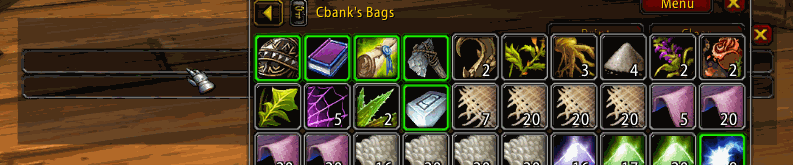

# Rename the folder from `sjLinkSpoof-master-XXXXX.zip` to just `sjLinkSpoof`

-   Console command: `/sjLinkSpoof` or `/sjls`
-   Show main window: `/sjls show`
-   **Top edit box**: Link preview
-   **Bottom edit box**: Raw link
